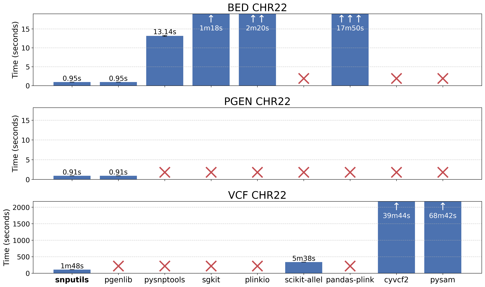

# Readers Benchmark

## Results

On the chromosome 22 of the 1000 Genomes Project dataset:



## Running the benchmark

The benchmark is run with the following command in the Phoenix compute cluster of the University of California Santa Cruz Genomics Institute:

```bash
conda create -n snputils python=3.12
conda activate snputils
pip install snputils[benchmark]
bash benchmark/run.sh --data-dir /private/groups/ioannidislab/salcc/snputils_data
```
The `--data-dir` argument specifies the directory where the data is stored. If the argument is not provided, it is stored in the `data` directory in the root of the repository. If the data is not found in the directory, it is downloaded from the internet.

Python 3.12 is used since some of the libraries are not yet compatible with Python 3.13 (not the case with snputils).

After running the benchmark, use the provided `plot.py` script to visualize the results:

```bash
python plot.py \
    --json-paths results/bed_chr22.json results/pgen_chr22.json results/vcf_chr22.json \
    --names snputils pgenlib pysnptools sgkit plinkio scikit-allel pandas-plink cyvcf2 pysam \
    --output benchmark.png \
    --titles
```

## Contributing

We strive to ensure fair comparisons across all libraries in our benchmark. If you believe the implementation using any of the compared libraries could be made more efficient, we warmly welcome your contributions! Please don't hesitate to open a pull request with your improvements. This helps ensure we're showcasing each library's best performance characteristics and benefits the entire genomics community.